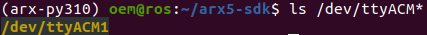

# 1. Build & Install
We set up a conda environment for all the cmake dependencies, so no system package is required. If you want to run ``cmake`` and ``make`` after modifying the C++ source files, please make sure you are under the created conda environment (``arx-py310`` etc.).
We recommend mamba for creating conda environments, which takes only about 1min. You can also use ``conda``, but it takes significantly longer (~10min).
```
cd arx5-sdk
```
## 1. conda
You can choose either ``conda`` or ``mamba``
```
conda env create -f conda_environments/py310_environment.yaml
# if you do not have mamba, you can also use conda, which takes significantly longer
# Currently available python versions: 3.8, 3.9, 3.10, 3.11 
conda activate arx-py310
mkdir build && cd build
cmake ..
make -j
# At this point, you should be able to run test scripts below.
```
## 1. mamba
```
mamba env create -f conda_environments/py310_environment.yaml
# if you do not have mamba, you can also use conda, which takes significantly longer
# Currently available python versions: 3.8, 3.9, 3.10, 3.11 
conda activate arx-py310
mkdir build && cd build
cmake ..
make -j
# At this point, you should be able to run test scripts below.
```
## 2. build
```
# To install the C++ package your system, run:
sudo make install
```

# 2. USB-CAN setup (recommend)
You can skip this step if you have already set up the EtherCAT-CAN adapter.
```
sudo apt install can-utils
sudo apt install net-tools
```
There are 2 popular firmware types of usb-can adapter, SLCAN and candleLight. After plugging the adapter, you can find out the correct firmware type by the following rules:
- Run ``ls /dev/ttyACM*``. If there is a new ``/dev/ttyACM*`` device (where * is a number), this adapter is using ``SLCAN`` firmware
```
ls /dev/ttyACM*
```


- Run ``ip a``. If there is a new ``can*`` interface (where * is a number), this adapter is using ``candleLight`` firmware.
## 1. For adapters using SLCAN framework
Get serial number by:
```
udevadm info -a -n /dev/ttyACM* | grep serial
# Replace the * by the actual number if there are multiple ttyACM devices connected to your computer.
```
You will get something like:
arm1
```
ATTRS{serial}=="207B32AE5052"
ATTRS{serial}=="0000:00:14.0"
```
arm2
```
ATTRS{serial}=="206A32B75052"
ATTRS{serial}=="0000:00:14.0"
```
Then edit CAN rules file:
```
sudo vim /etc/udev/rules.d/arx_can.rules
```
Copy and paste the following, and replace the serial number with yours. If you are registering multiple adapters, you can use other ``SYMLINK`` names (e.g. ``arxcan1``) and make sure the following commands are updated accordingly.
```
SUBSYSTEM=="tty", ATTRS{idVendor}=="16d0", ATTRS{idProduct}=="117e", ATTRS{serial}=="207B32AE5052", SYMLINK+="arxcan0"
SUBSYSTEM=="tty", ATTRS{idVendor}=="16d0", ATTRS{idProduct}=="117e", ATTRS{serial}=="206A32B75052", SYMLINK+="arxcan1"
```
Finally, activate CAN connection by: (the second line should be run every time after connection)
```
sudo udevadm control --reload-rules && sudo udevadm trigger
```
### can0
```
sudo slcand -o -f -s8 /dev/arxcan0 can0 && sudo ifconfig can0 up
```
### can1
```
sudo slcand -o -f -s8 /dev/arxcan1 can1 && sudo ifconfig can1 up
```
## 2. Test scripts
Arguments for ``test_joint_control.py``, ``keyboard_teleop.py``, ``spacemouse_teleop.py`` and ``teach_replay.py``:
- (required) model: ``X5`` (silver and black) or ``L5`` (all black metal with blue or red LED light). Choosing the wrong model may lead to dangerous movements!
- (required) interface: ``can0``, ``enx6c1ff70ac436`` etc. (run ip a to check your interface name)
- (optional) urdf_path ``-u``: by default ``../models/arx5.urdf``
### L5
#### arm1
```
cd python
python examples/test_joint_control.py L5 can0 # replace X5 with L5 for the other model 
python examples/keyboard_teleop.py L5 can0
python examples/spacemouse_teleop.py L5 can0
python examples/teach_replay.py l5 can0
```
#### arm2
```
cd python
python examples/test_joint_control.py L5 can1 # replace X5 with L5 for the other model 
python examples/keyboard_teleop.py L5 can1
python examples/spacemouse_teleop.py L5 can1
python examples/teach_replay.py L5 can1
```
#### bimanual
```
python examples/test_bimanual.py # For two L5 arms using can0 and can1, each arm will act the same as test_joint_control.py
```
### X5
```
cd python
python examples/test_joint_control.py X5 can0 # replace X5 with L5 for the other model 
python examples/test_bimanual.py # For two X5 arms using can0 and can1, each arm will act the same as test_joint_control.py
python examples/keyboard_teleop.py X5 can0
python examples/spacemouse_teleop.py X5 can0
python examples/teach_replay.py X5 can0
```
# 3. EtherCAT-CAN setup
Use a USB cable to power the EtherCAT-CAN adapter and an ethernet cable to connect it to your computer. After running ip a in your terminal, you should find the interface name, usually eth. (existing ethernet port) or en.......... (additional USB-Ethernet adapters).
Then you should enable the ethernet access of your Python interpreter (usually in your bin folder). Note that which python usually gives you a symbolic link (say ~/miniforge3/envs/arx-py310/bin/python) and doesn't work in this case. You need to find out the actual file (usually python3.x).
```
ls -l $(which python)
```
output
```
lrwxrwxrwx 1 robotics robotics 10 10月 28 15:07 /home/robotics/miniconda3/envs/arx-py310/bin/python -> python3.10
```
```
sudo setcap "cap_net_admin,cap_net_raw=eip" /home/robotics/miniconda3/envs/arx-py310/bin/python3.10
```
To run C++, you need to enable the executable every time after compiling. You also need to update the C++ scripts with the correct interface.
```
sudo setcap "cap_net_admin,cap_net_raw=eip" build/test_cartesian_controller
sudo setcap "cap_net_admin,cap_net_raw=eip" build/test_joint_controller
```